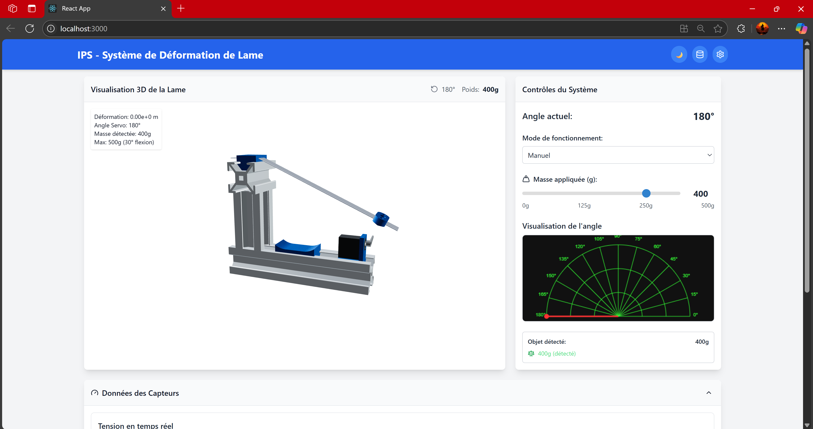
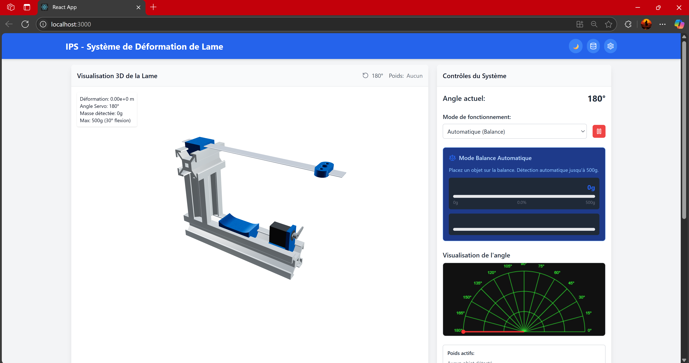

# 🔬 IPS - Système de Déformation de Lame

> Interface Homme-Machine (IHM) pour l'analyse et la visualisation en temps réel de la déformation d'une lame cantilever contrôlée par STM32.

[](https://reactjs.org/)
[](https://nodejs.org/)
[](https://threejs.org/)
[](https://socket.io/)
[](LICENSE)

## 📖 Description

Cette application offre une interface moderne et intuitive pour contrôler et visualiser un système de déformation de lame en temps réel. Elle combine une visualisation 3D interactive avec des graphiques de données temps réel, permettant l'analyse des propriétés mécaniques d'une lame cantilever.

### ✨ Fonctionnalités Principales

- 🎮 **Mode Manuel** : Contrôle direct du servo moteur avec positionnement précis
- ⚖️ **Mode Automatique** : Détection automatique de masse avec balance intégrée  
- 🎯 **Visualisation 3D** : Modèle interactif de la lame avec animation en temps réel
- 📊 **Graphiques Temps Réel** : Surveillance de la tension, force, déformation et masse
- 🌓 **Mode Sombre/Clair** : Interface adaptable pour différents environnements
- 📱 **Interface Responsive** : Compatible desktop, tablette et mobile
- 💾 **Export de Données** : Sauvegarde des mesures au format JSON
- 🔌 **Communication STM32** : Liaison série bidirectionnelle temps réel

## 🖼️ Aperçu de l'Interface

### Mode Manuel


- Contrôle du servo moteur par slider
- Lame fixe, seul le servo tourne
- Visualisation de l'angle en temps réel

### Mode Automatique  

- Détection automatique d'objets sur la balance
- Déformation de la lame selon la masse détectée
- Affichage des poids prédéfinis (20g, 40g, 50g, 70g, 90g, 100g)

## 🚀 Installation

### Prérequis

- **Node.js** >= 18.0.0
- **npm** >= 8.0.0  
- **STM32** configuré avec firmware compatible
- **Port série** disponible (ex: COM7 sur Windows)

### 1. Cloner le Projet

```bash
git clone https://github.com/ayoub-machkour/IHM-beam-deformation-3d.git
cd lame-deformation-app
```


### 3. Installation Backend (Serveur Node.js)

```bash
cd server
npm install 
npm start
```
### 2. Installation Frontend (React)

```bash
npm install 
npm start
```
### 3. Configuration du Port Série
Modifiez server.js pour votre port série :
```bash
const PORT = 'COM7';        // Windows : COM7, Linux : /dev/ttyUSB0
```
## ⚙️ Configuration
Structure des Fichiers
```bash
ips-beam-deformation/
├── public/
│   ├── models/
│   │   └── 11.glb              # Modèle 3D de la lame
│   └── index.html
├── src/
│   ├── components/
│   │   ├── BeamModel3D.js      # Visualisation 3D
│   │   ├── ControlPanel.js     # Panneau de contrôle  
│   │   └── DataDisplay.js      # Affichage des données
│   ├── controllers/
│   │   └── serialController.js # Communication STM32
│   ├── models/
│   │   └── socketInit.js       # Configuration Socket.io
│   ├── utils/
│   │   └── physicsCalculator.js # Calculs physiques
│   ├── App.js                  # Composant principal
│   ├── index.js               # Point d'entrée React
│   └── index.css              # Styles Tailwind
├── server.js                  # Serveur Node.js
├── package.json              # Dépendances React
└── README.md                 # Documentation
```
## 3. Vérification de la Connexion
```bash
✅ Voyant vert : STM32 connecté
❌ Voyant rouge : Vérifiez le port série et le câble USB
```

## 4. Modes d'Utilisation

### Mode Manuel 🎮

- Sélectionnez "Manuel" dans le panneau de contrôle
- Ajustez la masse avec le slider (0-500g)
- Le servo moteur s'oriente selon la masse
- La lame reste fixe (pas de déformation)

### Mode Automatique ⚖️

- Sélectionnez "Automatique (Balance)"
- Placez un objet sur la balance
- Détection automatique de la masse
- Le servo ET la lame bougent selon la masse détectée

## 📊 Communication STM32
### Commandes Envoyées au STM32 :
```bash
1,<masse>e          # Mode manuel : envoie la masse
2,1e                # Activation mode automatique  
2,0e                # Désactivation mode automatique
```
### Données Reçues du STM32 :
```bash
V:<valeur>          # Tension (Volts)
M:<valeur>          # Masse détectée (grammes)  
F:<valeur>          # Force calculée (Newtons)
A:<valeur>          # Angle servo (degrés)
ACK:<mode>,<angle>  # Accusé de réception
```
## Format des Données

```bash
Tension : 0.000 - 2.000 V (3 décimales)
Masse : 0 - 500 g (entier ou prédéfinie)
Force : 0.000 - 5.000 N (3 décimales)
Angle : 0 - 180° (entier)
```
# 🛠️ Technologies Utilisées
## Frontend

- React 18.x - Framework UI
- Three.js r128 - Rendu 3D
- @react-three/fiber - React + Three.js
- @react-three/drei - Helpers Three.js
- Chart.js - Graphiques temps réel
- Socket.io-client - Communication temps réel
- Tailwind CSS - Framework CSS
- Lucide React - Icônes

## Backend

- Node.js 18.x - Serveur JavaScript
- Express - Framework web
- Socket.io - WebSockets
- SerialPort - Communication série
- CORS - Gestion CORS

Hardware

- STM32 - Microcontrôleur
- Servo Moteur - Actionnement
- Capteurs - Mesure tension/force
- Balance - Détection masse